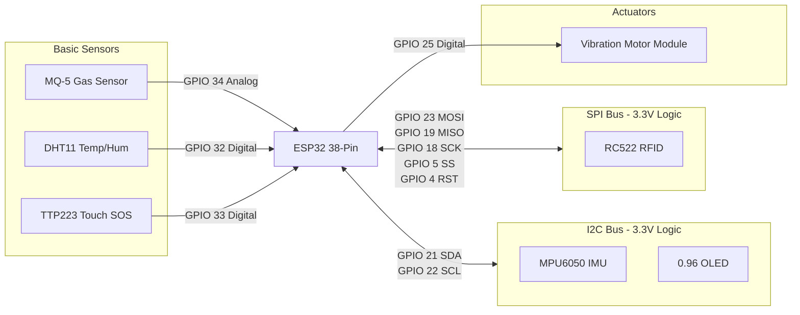

# silentStack Circuit Diagram

Here is the complete wiring architecture for assembling the prototype.

## Visual Wiring Flow

## Pin-to-Pin Wiring Table

**Power Supply Caution:** The ESP32 logic runs at **3.3V**. Connecting 5V signals directly to standard GPIOs can damage the board. The MQ-5 requires 5V for its internal heater, but its analog output is safe for ESP32's ADC pins. Follow this table exactly.

| Component | Component Pin | ESP32 Pin | Power Source | Notes |
| :--- | :--- | :--- | :--- | :--- |
| **MPU6050** | VCC GND SDA SCL | 3V3 GND GPIO 21 GPIO 22 | 3.3V | Share the I2C bus lines with the OLED. |
| **OLED (SSD1306)** | VCC GND SDA SCL | 3V3 GND GPIO 21 GPIO 22 | 3.3V | Share the I2C bus lines with the MPU6050. |
| **RC522 (RFID)** | 3.3V RST GND MISO MOSI SCK SDA (SS) | 3V3 GPIO 4 GND GPIO 19 GPIO 23 GPIO 18 GPIO 5 | 3.3V | **Do NOT connect this to 5V**, it will permanently damage the RC522 chip. |
| **MQ-5** | VCC GND A0 | VIN / 5V GND GPIO 34 | 5V | Needs 5V for the heater. A0 is safe for `GPIO 34`. |
| **DHT11** | VCC GND DATA | 3V3 GND GPIO 32 | 3.3V | Add a 10k resistor between VCC and DATA if needed. |
| **TTP223 (SOS)** | VCC GND SIG / I-O | 3V3 GND GPIO 33 | 3.3V | Simple digital high/low trigger. |
| **Vibration Motor**| VCC GND IN / PWM | 3V3 or 5V GND GPIO 25 | -- | **Important:** Use a "Vibration Motor Module" with a built-in transistor, or wire an NPN transistor (like a 2N2222) to drive it safely. |
